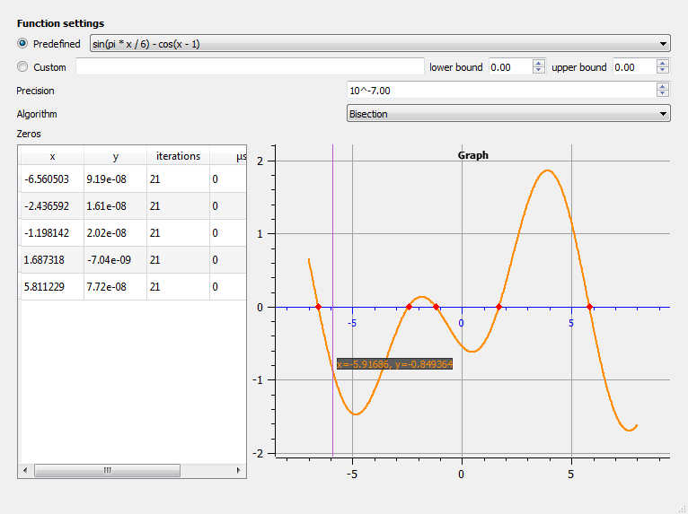
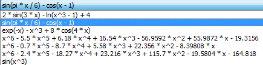
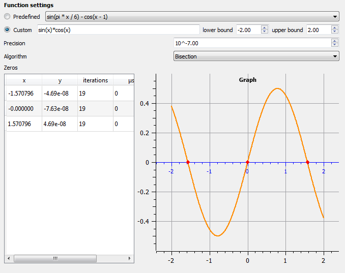
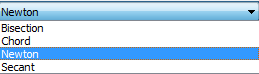
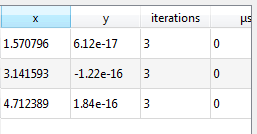
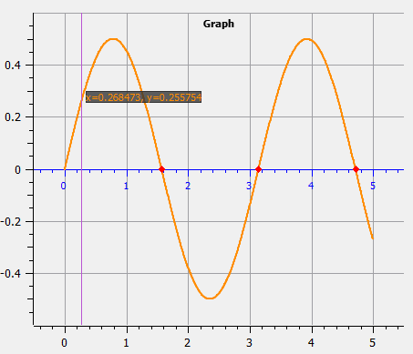
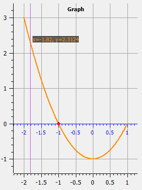
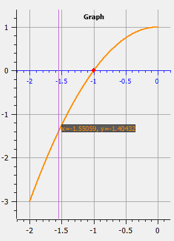
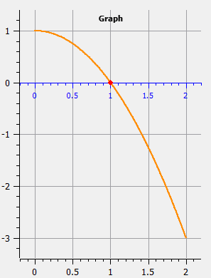
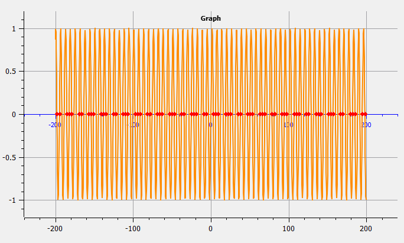

# CNMO, Laborator 1.

A realizat: **Curmanschii Anton, IA1901**.

Întregul cod puteți privi [pe github](https://github.com/AntonC9018/uni-cnmo).

[Documentul acesta pe github](https://github.com/AntonC9018/uni-cnmo/blob/master/doc/CNMO_Laborator_1.md).

## Sarcina

Se consideră ecuația $f(x)$, unde funcția $f(x)$ este definită interactiv sau este selectată dintr-o colecție de funcții date. În baza pseudocodurilor elaborate pentru rezolvarea prin metode iterative a ecuațiilor neliniare scalare, realizați o interfață grafică de utilizator (GUI)MATLAB, care permite efectuarea următoarelor acțiuni:
- Utilizatorului i se oferă posibilitatea să precizeze următoarele date:
    1. Informația cu privire la ecuația $f(x)$, care este definită sau interactiv, sause selectează dintr-o colecție de probleme test. 
    2. Precizia de calcul al rădăcinilor ecuației (va varia între $(10^{-10}, 10^{-5})$).
    3. Metoda iterativă ce urmează a fi aplicată la rezolvarea ecuației. Pentru calculul rădăcinilor utilizatorul va selecta una dintre metodele iterative:
        a. metoda bisecției;   
        b. metoda Newton;   
        c. metoda secantelor;   
        d. metoda coardelor.   
- Localizarea tuturor rădăcinilor reale de pe intervalul $[a, b]$ ale ecuației $f(x)$, folosind metoda tabelară în combinație cu metoda grafică;
- Folosind metoda selectată, calculul cu precizia $\\epsilon$ fiecărei rădăcini ce a fost localizată pe $[a, b]$, valoarea lor definită de către utilizator. Se vor preciza inclusiv rădăcinile de multiplicitate pară.
- Afișarea în subferestrele interfeței grafice a următoarei informații:
    1. Rădăcinile ecuației;
    2. Valorile funcției $f(x)$ în rădăcini;
    3. Numărul de iterații efectuate cu metoda aplicată, necesar pentru a atinge exactitatea cerută;
    4. Pentru fiecare rădăcină se va indica timpul necesar pentru calculul acesteia cu precizia cerută;
    5. Pentru fiecare metodă afișați și reprezentați grafic variația erorii Cauchy (distanța dintre două iterații succesive) și a reziduului $f(x)$ pe parcursul iterațiilor (Acest punct nu l-am făcut).
- Se va întocmi o dare de seamă ce va conține:
    1. Formularea problemei.
    2. Prezentarea metodelor și algoritmilor de soluționare.
    3. Analiza rezultatelor și concluzii cu privire la eficiența metodelor implementate. Se vor compara rezultatele obținute prin diferite metode (eficiența lor relativă în rezolvarea problemei date) și se va evidenția metoda optimă pentru rezolvarea ecuațiilor considerate.


## Introducere

Pentru lucrarea dată, am hotărât să încerc Qt pentru realizarea interfeței grafice. Însă, așa ca nu utilizez MATLAB, mi-am adăugat niște probleme pe care trebuie să le soluționez pentru a realiza lucrarea, anume:
1. Înțelegerea sistemului de build al lui Qt.
2. Reprezentarea graficelor funcției în Qt.
3. Expresii matematice (definirea funcțiilor din text) în C++.
4. Luarea derivatelor de așa expresii arbitrare (necesar pentru unele metode).

Voi trece peste aceste subiecte, explicând ce am descoperit și ce probleme am întâlnit.

După ce am discutat aceste chestii, voi prezenta interfața și analiza algoritmilor propuși.


## Qt

Am decis să utilizez Qt pentru acest proiect. Qt este una din cele mai populare biblioteci pentru interfețe grafice cross-platform. Nu am utilizat Qt niciodată. De fapt, nici nu am știut nimic despre Qt.

Partea cea mai avantajoasă a lui Qt este documentarea. Documentarea lui Qt este minunată, în special în comparare cu documentarea lui `gtkmm`, care am utilizat pentru proiect la criptografie.

Qt instalează, împreună cu însăși biblioteca, un număr de intrumente suplimentare. De exemplu, aplicația `Qt Creator`, `Qt Designer`, instrumentele `ninja` și `qmake` pentru build.

`Qt Creator` este un fel de IDE pentru lucru cu Qt. Îmi place să utilizez `VS Code` peste tot, deci eu l-am lăsat numai să-mi genereze proiectul, pe urmă am studiat cum lucrează procesul de build, și am sărit înapoi în `VS Code`.

### Build

Procesul de build în Qt este interesant. 

Este posibil de a utiliza `CMake` ori `qmake` (analogul lui `CMake` dar desemnat special pentru Qt). Așa ca eu doream demult să studiez `CMake`-ul, am hotărât să-l utilizez pe el. Cu `CMake`, generați un fișier care conține toate opțiunile, drumuri la biblioteci, fișierele sursă, etc. pentru proiectul dat. 

Qt adaugă la această instumentul `ninja` care, după cum am înțeles, construiește un *dependency graph* dintre toate fișierele din proiect, astfel numai fișierele care depind de cel schimbat vor fi recompilate.

Qt mai folosește un număr de *meta-compilatori*: 
1. `MOC` - introduce sintaxa specială de semnale și sloturi (printre alte).
2. `UIC` - procesează fișierele `XML` speciale pentru `UI` și produce fișiere header cu toate componentele din acel fișier.
3. `RCC` - compilează resurse în fișiere speciale (nu-i utilizez proprietățile).

Adăugător, mi-am făcut și un fișier batch pentru compilarea + pornirea aplicației din consola.

Priviți fișierele [CMakeLists.txt](https://github.com/AntonC9018/uni-cnmo/blob/master/CMakeLists.txt), [run.bat](https://github.com/AntonC9018/uni-cnmo/blob/master/run.bat). Știu, că ele nu sunt portabile, însă deocamdată nu am necesitate.

## Qwt

`Qwt` este biblioteca pentru Qt pentru reprezentarea graficelor și chestiilor legate de ele. Documentarea, în contrast cu cea a lui Qt, este destul de mediocră. Lucru bun că include niște exemple întrege de cod, descifrând care devine ceva clar modul de funcționare a bibliotecii. Am fost nevoit să pierd un timp semnificativ cu aceasta, dar la sfârșit m-am descurcat.


## Expresii matematice

Aici, am încercat 3 librării. 

Dacă dați search în google pentru "parsing math expressions in C++" primul search vă dă `exprtk`. Însă, este o mare problemă legată de el — el este prea masiv. Exemplul minimal cu funcționalități de bază de 10 linii de cod (interpretarea expresiei matematice dintr-un șir de caractere) la mine compila 15 minute: 5 minute compilarea, 10 minute linkarea. Nu doar aceasta — nici nu este posibil să-l compilați fără ambele flaguri de optimizare și flagul `-Wa,-mbig-obj` care permite să depășiți limita maximă de mărimea unui fișier obj. Dacă sunteți interesați, urmăriți likurile din [CMakeLists.txt](https://github.com/AntonC9018/uni-cnmo/blob/master/CMakeLists.txt#L62). În orice caz, mărimea lui gigantică l-a făcut inutil.

A doua variantă pe care am încercat-o, era [cparse](https://github.com/cparse/cparse). [Însă, am avut probleme cu el](https://github.com/cparse/cparse/issues/78). În plus, el nu conține funcții pentru diferențiere și codul lui este prea complicat, deci aș pierde prea mult timp realizând această funcționalitate eu singur. Am încercat să caut ceva mai simplu. 

Am găsit a treia librărie, pe care am decis s-o utilizez — [tinyexpr](https://github.com/codeplea/tinyexpr). Este în întregime în C. Codul este foarte minim și ușor de modificat, dar fără funcționalitatea de diferențiere. Însă datorită faptului că biblioteca este mică, singur am augmentat-o cu abilitatea de a calcula derivate simbolice (cu unele condiții și fără error-checking). [Priviți acest link](https://github.com/codeplea/tinyexpr/issues/73#issuecomment-787498773). 

Realizez că aș fi putut calcula derivate prin aproximări, utilizând însăși funcțiile, dar aceste derivate ar fi ele însăși aproximative, ce se simte ca înșelare. Ca exemplu:
```C++
// Numerically differentiate function f at point x with step delta
template<typename Function>
inline double differentiate(Function& f, double x, double delta)
{
    return (f(x + delta) - f(x)) / delta;
}
```

Am învestigat încă o variantă, anume `boost::spirit`. `boost::spirit` este un instrument foarte general desemnat dezvoltării parserurilor și gramaticelor. Este un lucru despre care eu aș dori să cunosc mai mult în viitor, dar nu în scopul proiectului acesta.


## Prezentarea interfeței

Astfel arată ui-ul pentru prezentarea algoritmilor pentru aproximarea zerourilor:



În sus putem selecta o funcție dintr-o listă de funcții încorporate. [Remarci la cod](#funcțiile-încorporate).



Mai jos putem defini funcția personalizată. 


După selectarea unei funcții, sau schimbarea a valorilor-capete, graficul și datele la aproximări imediat se schimbă în răspuns. 
[Remarci la cod](#responsivitatea).



Putem alege și precizia de calcul, ce imediat schimbă datele la aproximări.


Putem alege metoda aplicată la aproximări (tot schimbă rezultatele imediat).



Tabelul arată valorile rădăcinilor găsite, valorile funcției exacte la acele puncte, numărul de iterații trecut pentru atingere a exactității cerute și cât timp a luat executarea algoritmului. (Aici vedem zerouri, deoarece se execută prea rapid, și deoarece precizia timerului nu este ideală. Nu am încercat să folosesc nanosecundele, dar ghicesc că precizia nu ar fi foarte favorabilă. Uneori numărul de microsecunde aleator sare la 10000 — probabil timer-ul nu este capabil să le estimeze nici pe ele. Pentru determinarea mai exactă a timpului trecut la execuție, trebuie să facem mai multe iterații ale aloritmului). Pentru măsurarea timpului trecut refolosesc codul care am scris pentru ASDC. [Despre cum măsur timpul](https://github.com/AntonC9018/uni_asdc/blob/master/doc/ASDC_Laborator_1.md#profilatorul).



Graficul arată funcția selectată curent și punctele de intersecție cu axa OX, găsite de către metoda curentă.




# Algoritmii

Vor fi prezentate algoritmii în așa mod: descrierea succintă; codul, explicații la cod; Remarcile la complexitate.

## Metoda bisecției

### Descrierea succintă

Metoda bisecției lucrează prin înjumătățirea intervalului la fiecare iterație. Astfel, algoritmul este asemănător cu căutarea binară.

Avantajul principal al acestei metode este faptul că metoda converge stabil pentru orice funcție. Disavantajul este faptul că convergența este lentă în comparație cu alte metode.

### Cod

Condițiile inițiale sună astfel: `a` din intervalul de căutare trebuie să fie mai mic ca `b`, funcția trebuie să-și schimbe semnul la capete. În codul de mai jos, funcția `signbit()` inspectează primul bit al numărului floating point de precizie dublă care în reprezentarea canonică conține informația despre semn: dacă bitul este setat (funcția dă true), semnul este negativ, altfel — pozitiv.
```C++
template<typename Function>
inline bool bisection_conditions_met(Function& f, const Interval i)
{
    return i.start < i.end && signbit(f(i.start)) != signbit(f(i.end)); 
}
```

Întrega funcție pentru metoda bisecției:
```C++
template<typename Function>
double bisection(
    Function& f, 
    Interval inter, 
    Error_Data* error_data, 
    Profiler* profiler = &_std_profiler)
{
    RF_INITIAL_CHECK(bisection_conditions_met(f, inter));
    size_t i = 0;
    bool sign_start = signbit(f(inter.start));

    while (i < error_data->max_iters)
    {
        profiler->num_iters++;

        double middle = (inter.start + inter.end) / 2;
        double length = inter.end - inter.start;

        if (f(middle) < error_data->tolerance 
            && length < error_data->tolerance * 2)
        {
            return middle;
        }
        if (signbit(f(middle)) == sign_start) 
        {
            inter.start = middle;
        }
        else
        {
            inter.end = middle;
        }
        i++;
    }

    RF_ITERATIONS_ERROR();
}
```

Condiția `f(middle) < error_data->tolerance && length < error_data->tolerance * 2` verifică dacă precizia cerută a fost atinsă, iar `signbit(f(middle)) == sign_start` decide, cum va fi ajustat intervalul. Dacă funcția nu și-a schimbat semnul de la cel inițial, înseamnă că este în aceeași parte a rădăcinei (stângă), deci ajustăm capetele din stânga. Însă, dacă valoarea nouă a depășit zeroul (este deja în partea dreaptă), ajustăm capetele din dreapta.

### Complexitatea

Eroarea se împărțește în jumătate la fiecare iterație, deci algoritmul converge linear.


## Metoda Newton

### Descrierea succintă

Metoda Newton folosește derivata pentru a se apropia de rădăcina. (Această animație)[https://upload.wikimedia.org/wikipedia/commons/e/e0/NewtonIteration_Ani.gif?1615397089064] explică procesul (urmăriți linkul dacă imaginea de mai jos este statică):


Avem de fapt două variante a metodei: una mai simplă, alta cu start ajustat. În scurt, după cum am înțeles, a doua metodă garantează un start mai favorabil decât metoda fără startul ajustat, ceea ce asigură convergența mai rapidă. În algoritmul cu ajustare, începem în locuri, unde valoarea funcției are același semn ca convexitatea (valoarea defivatei de ordinul 2). După cum înțeleg, aceasta semnifică că, de exemplu, pentru $x^{2}$, începem pe latura graficului, mai degrabă decât în jgheab.

Pe imaginile de mai jos, începem din partea stânga (de pe latură). În primul exemplu, $f''(x) > 0, f(x) > 0$, în al doilea exemplu, $f''(x) < 0, f(x) < 0$.






Însă în cazul de mai jos, începem din partea dreaptă (tot de pe latură).



### Cod

Unica condiție este ca derivata să nu fie 0 în punct de start (în acest caz algoritmul nu progresează).
```C++
template<typename Derivative>
inline bool newton_conditions_met(
    Derivative f_derivative, const double x_initial_guess)
{
    return f_derivative(x_initial_guess) != 0;
}
```

Funcția principală (neajustată):
```C++
template<typename Function, typename Derivative>
double newton(
    Function& f, 
    Derivative f_derivative, 
    const double x_initial_guess, 
    Error_Data* error_data,
    Profiler* profiler = &_std_profiler)
{
    RF_INITIAL_CHECK(newton_conditions_met(f_derivative, x_initial_guess));

    size_t i = 0;
    double x = x_initial_guess;

    while (i < error_data->max_iters)
    {
        double f_x = f(x);
        double dx = f_x / f_derivative(x);
        x = x - dx;

        profiler->num_iters++;

        if (abs(f_x) < error_data->tolerance && abs(dx) < error_data->tolerance)
            return x;

        i++;
    }

    RF_ITERATIONS_ERROR();
}
```

Metoda ajustată selectează start ori end din intervalul dat, pe urmă apelează funcția principală:
```C++
template<typename Function, typename Derivative, typename Second_Derivative>
double newton_enhanced_start(
    Function& f, 
    Derivative f_derivative, 
    Second_Derivative f_second_derivative,
    const Interval inter,
    Error_Data* error_data,
    Profiler* profiler = &_std_profiler)
{
    // Start on the side rather than in a trough
    const double x_initial = signbit(f(inter.start)) == signbit(f_second_derivative(inter.start))
        ? inter.start : inter.end; 
    
    return newton(f, f_derivative, x_initial, error_data, profiler); 
}
```

### Complexitatea

În majoritatea cazurilor, cuadratică. Însă, în unele situații, ba nici nu converge pentru unele funcții, ba converge lent pentru funcții cu valoarea derivatei sau a derivatei de ordinul doi mice.


## Metoda secantelor

### Descrierea succintă

Metoda secantelor este identică cu metoda Newton, cu singura modificare că valoarea derivatei este aproximată, băzându-se la aproximarea x-ului curentă și cea precedentă.

Avantajul metodei este că ea poate funcționa fără derivata exactă.

### Cod

Condiția este asemănătoare la condiția metodei Newton:
```C++
template<typename Function>
inline bool secant_conditions_met(Function& f, const Interval i)
{
    return f(i.start) != f(i.end);
}
```

Codul se diferă de la codul la metoda Newton prin faptul că aproximează derivata.
```C++
template<typename Function>
double secant(
    Function& f, 
    const double x0, 
    const double x1, 
    Error_Data* error_data, 
    Profiler* profiler = &_std_profiler)
{
    size_t i = 0;
    double x        = x1;
    double f_x_prev = f(x0);
    double dx       = x1 - x0;

    while (i < error_data->max_iters)
    {
        double f_x = f(x);

        profiler->num_iters++;

        if (abs(f_x) < error_data->tolerance && abs(dx) < error_data->tolerance)
            return x;

        dx *= f_x / (f_x_prev - f_x);
        x += dx;
        f_x_prev = f_x; 
        i++;
    }

    RF_ITERATIONS_ERROR();
}
```

Metoda ajustată selectează capetele și metoda Newton, numai că sunt luate două valori apropiate.
```C++
template<typename Function, typename Derivative>
double secant_enhanced_start(
    Function& f, 
    Derivative f_second_derivative, 
    const Interval inter,
    Error_Data* error_data, 
    Profiler* profiler = &_std_profiler)
{
    RF_INITIAL_CHECK(secant_conditions_met(f, inter));

    double x0;
    double x1;

    // Choose the place where the derivative is bigger. Imagine x^2 graph.
    // This condition will always get you on the steep slope rather than in the trough.
    if (signbit(f(inter.start)) == signbit(f_second_derivative(inter.start)))
    {
        x0 = inter.start;
        x1 = inter.start + error_data->tolerance;
    }
    else
    {
        x0 = inter.end;
        x1 = inter.end - error_data->tolerance;
    }

    return secant(f, x0, x1, error_data, profiler);
}
```

### Complexitatea

Identică cu Newton.


## Metoda coardelor
### Descrierea succintă

Lucrează prin aducerea coardei din punctele $(x_k, f(x_k))$ și $(x_0, f(x_0))$, pentru a găsi a doua aproximare, $x_{k+1}$.

### Cod

Condiția de bază: $f(x)$ își schimbă semnul:
```C++
template<typename Function>
inline bool chord_conditions_met(Function& f, const Interval i)
{
    return signbit(f(i.start)) != signbit(f(i.end)); 
}
```

Codul funcției. În desenul ASCII formula este inversată, deoarece $f(x) < 0$:
```C++
template<typename Function, typename Derivative>
double chord(
    Function& f, 
    Derivative f_second_derivative, 
    const Interval inter, 
    Error_Data* error_data, 
    Profiler* profiler = &_std_profiler)
{
    RF_INITIAL_CHECK(chord_conditions_met(f, inter));

    // Whether the start is in the trough or outside one.
    bool side_start = signbit(f(inter.start)) == signbit(f_second_derivative(inter.start));

    // Always start in the trough.
    double x = side_start ? inter.end : inter.start;

    // Rel stands for relative. The approximations 
    // are always calculated relative to this value.
    double x_rel = side_start ? inter.start : inter.end;
    double f_rel = f(x_rel);

    size_t i = 0;

    while (i < error_data->max_iters)
    {
        double f_x = f(x);

        /*   x_new
             x  \  /|
              \  |/ | < f(rel)
          _____._.__|____________ x = 0 
                /_|_| < f(x)
               |_|  ^
                ^  x_rel  
                dx
            
            dx / f(x) = (x_rel - x) / (f(rel) - f(x))
            x_new = x + dx
        */
        double dx = (x - x_rel) * f_x / (f_rel - f_x);
        x += dx;

        profiler->num_iters++;

        if (abs(f_x) < error_data->tolerance && abs(dx) < error_data->tolerance)
            return x;
        
        i++;
    }

    RF_ITERATIONS_ERROR();
}
```

### Complexitatea

Identică cu Newton.


## Compararea

Din punct de vedere teoretic, algoritmii agresivi (toate în afară bisecției) vor fi mai puțin stabile, dar vor fi mai eficiente pentru majoritatea funcțiilor ca rezultat. În practică observăm exact acest lucru: 
1. Algoritmii agresivi converg într-un număr mai scăzut de iterații. De exemplu, pentru exactitatea $10^{-7}$, funcția $sin(x^{3})$, cu metoda bisecției zerourile converg în 20 de iterații, iar cu celelalte metode în 5-6 iterații.
2. Algoritmii agresivi uneori rezultă în mai multe iterații, de exemplu, când derivata este mică pentru Newton, când derivată este prea mare pentru Coardele. Atunci, numărul de iterații devine mai mare decât cela primit cu metoda bisecției.
3. Algoritmii agresivi sunt mai puțin stabile, uneori estimând zeroul care nici nu era în intervalul inițial. Poate acest lucru are loc când intervalele inițiale sunt prea mari.
4. Dacă mărim exactitatea (facem valoarea $\\epsilon$ mai mică), pentru metoda bisecției numărul de iterații finale crește mai rapid decât la celelalte metode. Din aceaași cauză, exactitatea primită la metodele agresive este de obicei cu mult mai mare decât cea cerută.

Din cauza că timer-ul nu este suficient de exact, vom face un script-test în consolă pentru a profila toate funcțiile încorporate, și ne vom uita la datele medie și totale pentru a evalua algoritmii.

Codul puteți privi [aici](https://github.com/AntonC9018/uni-cnmo/blob/master/src/rootfinding/test.cpp#L83), rezultatele executării puteți privi [aici](https://github.com/AntonC9018/uni-cnmo/blob/master/src/rootfinding/results.txt).

> Chestiile de menționat referitor la datele culese: metoda Newton se va executa mai lent din cauza că evaluăm derivata. În general evaluarea unei expresii din `tinyexpr` va fi mai lentă decât avaluarea unei funcții normale, iar cazul cu derivata avem o expresie neoptimizată (de exemplu, $3\*x$ după derivarea ar devine $3\*1+0\*1$ și aceste operații adăugătoare vor fi evaluate la fiecare executare a funcției, deci *take it with a grain of salt*).

Datele au arătat că numărul cel mai mic de iterații peste toate experimentele a avut metoda Newton, iar metoda cea mai rapidă pentru executare — metoda secantelor. Pe înțelese: metoda Newton calculează derivata, ceea ce este mai scump în cazul meu, decât aproximarea, metoda secantelor calculează o aproximare, iar metoda coardelor face mai multe calculări decât metoda secantelor.

Însă metoda bisecției este una specială, deoarece, cum a fost menționat anterior, ea este unica stabilă metodă din setul de metode propus, în sensul că mereu converge la rădăcină într-un număr previzibil sau așteptabil de iterații, oricare ar fi funcția dată lui.


# Remarci la cod

## Funcțiile încorporate

În cod, ele sunt păstrate și compilate ca o variabilă globală, care conține însăși funcția, textul pentru expresia a funcției, limitele a și b. `func_make()` apelează funcția-constructor, iar `str_lit()` învelește șirul de caractere într-o structură `str_view_t`, care conține lungimea șirului pe lângă pointerul la caractere. Pentru mai multă informație la funcțiile utilizate în prelucrarea șirurilor, priviți [biblioteca mea mică pentru prelucrarea șirurilor de caractere](https://github.com/AntonC9018/strlib).
```c++
static Expression_Func funcs[]
{
    func_make(str_lit("2 * sin(3 * x) - ln(x^3 - 1) + 4"), 2, 9),
    func_make(str_lit("sin(pi * x / 6) - cos(x - 1)"), -7, 8),
    func_make(str_lit("exp(-x) - x^3 + 8 * cos(4 * x)"), -4, 4),
    func_make(str_lit("x^6 - 5.5 * x^5 + 6.18 * x^4 + 16.54 * x^3 - 56.9592 * x^2 + 55.9872 * x - 19.3156"), -3, 4),
    func_make(str_lit("x^6 - 0.7 * x^5 - 8.7 * x^4 + 5.58 * x^3 + 22.356 * x^2 - 8.39808 * x"), -3, 4),
    func_make(str_lit("x^6 - 2.4 * x^5 - 18.27 * x^4 + 23.216 * x^3 + 115.7 * x^2 - 19.5804 * x - 164.818"), -3, 4),
    func_make(str_lit("sin(x^3)"), -3, 3)
};
```

```c++
struct Expression_Func
{
    str_view_t text;
    te_expr* expr;
    te_expr* derivative;
    te_expr* second_derivative;
    double x;
    te_variable variable;
    double upper_bound;
    double lower_bound;

    inline double operator()(double x);
};

inline Expression_Func func_make(str_view_t text, double lower, double upper, int* error = NULL)
{
    Expression_Func func;
    func.text        = text;
    func.variable    = { "x", &func.x };
    func.lower_bound = lower;
    func.upper_bound = upper;
    func_compile(&func, error);
    return func;
}
```

Încă, la compilarea expresiilor, derivatele sunt imediat calculate și păstrate ca expresii din `tinyexpr`.
```c++
inline void func_compile(Expression_Func* func, int* error = NULL)
{
    func->expr = te_compile(func->text.chars, &func->variable, 1, error);
    
    if (!error || !(*error))
    {
        func->derivative = te_differentiate_symbolically(func->expr, &func->variable, error);
        func->second_derivative = te_differentiate_symbolically(func->derivative, &func->variable, error);
    }
}
```

Este ceva urât faptul că se folosește variabila `x`, separată de variabila din `tinyexpr` (`te_variable`) și că același x este utilizat la calcularea valorilor și a funcției și a derivatelor. Aceasta înseamnă că paralilezarea ar fi imposibilă fără modificări ai codului și în general evaluarea expresiilor este ceva anevoioasă. De exemplu, pentru a evalua funcția într-un punct dat, trebuie să fac așa ceva:
```C++
inline double func_eval(Expression_Func* func, double x)
{
    func->x = x;
    return te_eval(func->expr); 
}
```

Ideal, aș schimba modul în care sunt utilizate variabile în codul lui tinyexpr, dar nu vreau să mă adânc în această temă prea mult aici.


## Responsivitatea

Responsivitatea este atinsă prin folosirea sistemului de semnale din Qt. De exemplu, codul de mai jos arată cum sunt legate semnalul de schimbare a indicelui funcției încorporate selectate curent și schimbarea însăși variabilei ce păstrează funcția selectată curent.
```C++
// Selecting the builtin function 
connect(ui->function_selection_combo, 
        SIGNAL(currentIndexChanged(int)), 
        this, 
        SLOT(change_selected_builtin_function(int))
);
```

Funcția `change_selected_builtin_function()` arată astfel:
```C++
void MainWindow::change_selected_builtin_function(int index)
{
    if (index < Builtin::func_count)
    {
        selected_builtin_function = &Builtin::funcs[index];

        if (ui->function_builtin_rbutton->isChecked())
            emit selected_function_changed();
    }
}
```

Sintaxa `emit selected_function_changed()` emite semnalul că funcția selectată s-a schimbat. Remarcă: acest semnal este emis în acest caz numai dacă este selectată opțiunea de folosire a funcțiilor încorporate.

Am conectat mai multe sloturi la semnalul acesta de schimbare a funcției. De exemplu, redesenarea graficului:
```C++
connect(this, SIGNAL(selected_function_changed()),
        this, SLOT(changed_function_redraw_graph()));
```

`changed_function_redraw_graph()` apelează funcția de recalculare a punctelor din elementul ui pentru grafice:
```C++
void MainWindow::changed_function_redraw_graph()
{
    auto selected_function = get_selected_function();

    if (selected_function->expr)
        ui->plot->update_curve(selected_function);
}
```

`get_selected_function()` returnează funcția încorporată selectată, sau cea personalizată, în dependența de alegerea curentă a utilizatorului.


## Localizare

Pentru localizare folosesc astfel o funcție:
```C++
template<typename Function>
std::vector<double> localize(Function& f, double start, double end, double step)
{
    std::vector<double> result;

    double x = start;
    double sign_f_x = signbit(f(x));

    while (x + step <= end)
    {
        double x_next = x + step;
        double sign_next = signbit(f(x_next));
        
        if (sign_f_x != sign_next)
        {
            // localized a root
            result.push_back(x);
        }

        x = x_next;
        sign_f_x = sign_next;
    }

    return result;
}
```

O apelez mereu pentru un număr constant de iterații totale, independent de valorile capetelor intervalelor:
```C++
const double num_steps = 100.0;
const double step = (func->upper_bound - func->lower_bound) / num_steps;
const auto zeros_xs = localize(*func, func->lower_bound, func->upper_bound, step);
```

Deci, pentru o funcție cu un număr semnificativ de zerouri, unele zerouri nu vor fi găsite.

