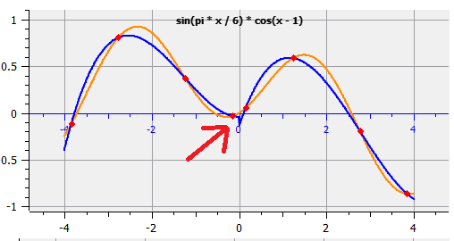

# CNMO, Laborator 2. Polinoame.

A realizat: **Curmanschii Anton, IA1901**.

Întregul cod puteți privi [pe github](https://github.com/AntonC9018/uni-cnmo).

[Documentul acesta pe github](https://github.com/AntonC9018/uni-cnmo/blob/master/doc/CNMO_Laborator_2.md).

[Descărcați interfața la acest laborator pentru Windows](https://github.com/AntonC9018/uni-cnmo/releases/tag/Laborator2).

## Sarcina

Interfața grafică cu următoarele capacități:

1. Extremitățile a și b ale intervalul \[a,b\];
2. Funcția f(x) din setul de funcții prestabilite, sau selectată interactiv;
3. Specificarea metodei de aproximare:
    - algoritmul Lagrange,
    - algoritmul Lagrange pe porțiuni,
    - spline-ul cubic;
4. Numărul de noduri ale rețelei pe care se va aproxima funcția. Pot fi:
    - echidistante,
    - Chebyshev,
    - aleatoare;
5. Folosind expresia analitică a funcției selectate, se vor calcula valorile funcției în punctele selectate;
6. Să se afișeze într-un tablou valorile x-urilor și valorile funcției; 
7. Să se afișeze graficul funcției de la a până la b;
8. Să se afișeze graficul erorii aproximării cu polinomul de interpolare;
9. Să se afișeze graficul polinomului nodurilor;

În darea de seama de inclus:
1. Sarcina;
2. Prezentarea metodelor și algoritmilor de soluționare;
3. Analiza evoluției erorii în dependența de:
    - numărul nodurilor de interpolare,
    - amplasarea nodurilor pe interval,
    - amplasarea punctelor z, unde se calculează valoarea polinomului, în mijlocul intervalului de interpolare și în capete.
    - algoritmul de aproximare selectat;
4. Avantajele și dezavantajele fiecărui algoritm.


## Prezentarea interfeței


Avem același meniu de selectare a funcției din laborator 1. Capetele la funcții prestabilite tot sunt prestabilite și sunt fixate, însă puteți introduce o funcție personalizată ca să puteți stabili aceste limite.

Restul interfeței urmărește sarcina.

Nu avem nici un buton "Run", deoarece interfața iarăși este reactivă.


# Algoritmii

## Lagrange simplu

### Descriere

Metoda Lagrange în forma simplă presupune aproximarea unei funcții arbitrare printr-un polinom de grad $n - 1$ și prin $n$ puncte 
$(x_i, f(x_i))$. 

În scurt, sunt găsite așa numite *polinoamele fundamentale*, $l_i(x)$. Proprietatea lor este că:
$$\forall x_j, j \neq i: l_j(x_j) = 1, l_i(x_j) = 0.$$

Expresia analitică a lor este: 
$$l_i(x) = \prod_{ j = 1, i \neq j }^{n} \dfrac { x - x_j } { x_i - x_j }.$$ 

Astfel, fiecare polinom fundamental este de un grad cel mult $n - 1$.

Polinomul de interpolare lui Lagrange se obține prin adunarea acestor polinoame fundamentale:

$$ L(x) = \sum_{ i = 1 }^{ n } f(x_i) l_i(x)= \sum_{ i = 1 }^{ n } f(x_i) \prod_{ j = 1, i \neq j }^{n} \dfrac { x - x_j } { x_i - x_j }.$$ 

### Cod

Ca să programăm metoda Lagrange, avem nevoie să definim modul în care să pastrăm polinoame și funcții pentru a le evalua. Uitați-vă în [remarci la cod](#polinoame), pentru această parte de cod. 

Funcția pentru estimare a polinomului Lagrange ia la intrare o listă de $x$ coordonate, în care a fost evaluată funcția $f(x)$, și o listă de valorile acestei funcții în aceste puncte, $y$.

Pentru fiecare `i`, funcția dată calculează numărătorul din formula lui $l_i$ de mai jos, păstrând coeficienții în tabloul temporar `t`, și numitorul, păstrând rezultatul în `denominator`. Pe urmă, valorile coeficienților lui $l_i$ se adaugă la polinom rezultant, după divizare la `denominator`.

[Unele remarci la acest cod](#lagrange-remarci).

```C++
Polynomial* lagrange_approximate_samples(
    const double xs[], 
    const double ys[], 
    size_t num_samples)
{
    Polynomial* result = p_alloc_zeros(num_samples);
    double* t = array_alloc(num_samples);

    for (size_t i = 0; i < num_samples; i++)
    {
        // reset t to 0
        memset(&t[1], 0, (num_samples - 1) * sizeof(double));

        // The result will have to be multiplied by yi, so set it right away.
        t[0] = ys[i];
        size_t current_degree = 1;
        double denominator = 1;

        for (size_t j = 0; j < num_samples; j++)
        {
            if (j != i)
            {
                // Multiplying by (x - xj) is the same as
                // Shifting all coefficients right and subtracting the coefficients times xj
                for (size_t k = current_degree; k >= 1; k--)
                {
                    t[k] = t[k - 1] - t[k] * xs[j];
                }
                t[0] = t[0] * -xs[j];

                // The denominator gets multiplied by the difference
                denominator *= (xs[i] - xs[j]);

                // One more degree is non-zero now
                current_degree++;
            }
        }

        // Invert the denominator
        double r_denominator = 1 / denominator;

        for (size_t j = 0; j < num_samples; j++)
        {
            // Multiply it into all of the coefficients, when adding
            result->coefficients[j] += r_denominator * t[j];
        }
    }

    free(t);

    return result;
}
```

## Lagrange pe porțiuni

### Descriere

Acest algoritm nu este foarte interesant din punct de vedere a codului. Pur și simplu aplicăm algoritmul Lagrange pentru diferitele porțiuni, și salvăm rezultatele într-un tablou.

Eu am implementat acest algoritm în mod leneș, adică păstrez un tablou de pointeri la polinoame, dar acest tablou ar putea fi un singur tablou de coeficienți, deoarece toate polinoamele sunt de același grad, am putea evita stocarea gradelor lor. 

[Unele remarci](#lagrange-pe-porțiuni-remarci).

### Cod

```C++
struct Polynomial_Portions
{
    size_t num_portions;
    double* xs;
    Polynomial** polynomials;

    inline double operator()(double x)
    {
        for (size_t i = 0; i < num_portions - 1; i++)
        {
            if (x < xs[i])
            {
                return p_eval(polynomials[i], x);
            }
        }
        return p_eval(polynomials[num_portions - 1], x);
    }
};

Polynomial_Portions p_make_portions(
    const double* xs, 
    size_t num_samples, 
    size_t num_portions)
{
    Polynomial_Portions result;
    result.xs = array_alloc(num_portions - 1);
    result.polynomials  = (Polynomial**) malloc(sizeof(Polynomial*) * num_portions);
    result.num_portions = num_portions;
    
    for (size_t i = 0; i < num_portions - 1; i++)
    {
        const double* _xs = &xs[i * num_samples];
        result.xs[i] = (_xs[num_samples - 1] + _xs[num_samples]) / 2;
    }

    return result;
}

Polynomial_Portions lagrange_approximate_samples_portions(
    const double* xs,
    const double* ys,
    size_t num_samples, 
    size_t num_portions)
{
    auto result = p_make_portions(xs, num_samples, num_portions);
    
    for (size_t i = 0; i < num_portions; i++)
    {
        result.polynomials[i] = lagrange_approximate_samples(
            &xs[i * num_samples], &ys[i * num_samples], num_samples
        );
    }

    return result;
}
```

## Spline cubic

### Descriere

Spline-ul cubic reprezintă un set de polinoame de gradul 3 (adică tot sunt pe porțiuni, ca și în cazul Lagrange), care aproximează funcția mai neted, ceea ce înseamnă că derivata de ordinul 1 și 2 a polinomului de pe porțiunea $m$ este egală cu derivata de ordinul 1 și 2 a polinomului de pe porțiunea $m+1$ în capătul din drepta.

Formulele se deduc prin rezolvarea unui sistem de ecuații, ce aduce la o soliție unică, însă necesită încă două ecuații pentru a fi complet. De obicei, se utilizează două așa perechi de ecuații: una setează valorile derivatelor de ordinul doi la capetele intervalelor la 0, alta le setează egale cu derivatele însăși funcției în acele puncte. În primul caz, așa spline-uri se mai numesc "naturale". Am realizat numai varianta aceasta de spline-uri.

[Un overview pentru matematica implicată](https://mathworld.wolfram.com/CubicSpline.html)

### Cod

Există un algoritm prestabilit pentru determinarea coeficienților ale acestor spline-uri. Admit, că nu am retrăit matematica asociată cu acest algoritm, ci pur și simplu l-am implementat în cod. Încă, soluția mea nu este perfectă, fiidcă fac unele copieri excesive.

```C++
Cubic_Spline* make_cubic_spline_normal(
    const double xs[], 
    const double ys[], 
    size_t num_samples)
{
    size_t num_polynomials = num_samples - 1;
    
    double* const temp_values = array_alloc(num_samples * 4 + num_polynomials * 4);
    double* const l = temp_values;             // some temporary
    double* const u = &l[num_samples];         // some temporary
    double* const z = &u[num_samples];         // some temporary
    double* const c = &z[num_samples];         // 3rd coeff
    double* const h = &c[num_samples];         // some temporary
    double* const d = &h[num_polynomials];     // 4th coeff
    double* const b = &d[num_polynomials];     // 2nd coeff
    double* const alpha = &b[num_polynomials]; // some temporary

    for (size_t i = 0; i < num_polynomials; i++)
    {
        h[i] = xs[i + 1] - xs[i];
    }

    alpha[0] = 0;
    for (size_t i = 1; i < num_polynomials; i++)
    {
        alpha[i] = 3.0 / h[i] * (ys[i + 1] - ys[i]) - 3.0 / h[i - 1] * (ys[i] - ys[i - 1]);
    }

    l[0] = 1;
    u[0] = 0;
    z[0] = 0;
    l[num_samples - 1] = 1;
    z[num_samples - 1] = 0;
    c[num_samples - 1] = 0;

    for (size_t i = 1; i < num_polynomials; i++)
    {
        l[i] = 2 * (xs[i + 1] - xs[i - 1]) - h[i - 1] * u[i - 1];
        u[i] = h[i] / l[i];
        z[i] = (alpha[i] - h[i - 1] * z[i - 1]) / l[i]; 
    }

    for (s32 i = num_polynomials - 1; i >= 0; i--)
    {
        c[i] = z[i] - u[i] * c[i + 1];
        b[i] = (ys[i + 1] - ys[i]) / h[i] - h[i] * (c[i + 1] + 2 * c[i]) / 3;
        d[i] = (c[i + 1] - c[i]) / (3 * h[i]);
    }

    auto spline = spline_alloc(num_samples);
    memcpy(spline_xs(spline), xs, sizeof(double) * num_samples);

    for (size_t i = 0; i < num_polynomials; i++)
    {
        double* coeffs = spline_coeffs_ith(spline, i);
        coeffs[0] = ys[i];
        coeffs[1] = b[i];
        coeffs[2] = c[i];
        coeffs[3] = d[i];
    }

    free(temp_values);
    return spline;
}
```


## Nodurile Chebyshev

### Descriere

Nodurile Chebyshev sunt $x$-urile care minimizează eroarea la metodele de aproximare a funcțiilor prin polinoame. Nodurile Chebyshev sunt proiecții punctelor de pe semicercul trigonometric pe axa $OX$ separate cu unghiurile egale.


Punctele, luate astfel, minimizează expresia:
$$ max \left( {\lvert} \omega_n(x) {\rvert} \right) $$

Unde $\omega_n(x)$ este *polinomul nodurilor*: 
$$ \omega_n(x) := \prod_{ i = 1 }^{n} (x - x_i) $$

Ele sunt interesante deoarece valoarea $f(x) - L(x)$ este proporțională cu $\omega_n(x)$, astfel minimizând ${\lvert} \omega_n(x) {\lvert}$, minimizăm și ${\lvert} f(x) - L(x) {\lvert}$, adică expresia erorii absolute.

Expresia analitică a acestor noduri este următoarea:
$$ x_i = -cos \left( \frac { (i + \frac{1}{2}) \pi } { n } \right) $$ 

[O animație interesantă referitor la aceste noduri](http://www.math.umd.edu/~petersd/460/nodepol.html)

### Cod

```C++
template<typename Function>
void chebyshev_nodes(
    Function& f, 
    double* xs,
    double* ys,
    size_t num_samples,
    double start = -1.0, 
    double end = 1.0)
{
    const double middle = (end + start) / 2;
    const double half_length = (end - start) / 2;

    for (size_t i = 0; i < num_samples; i++)
    {
        // Calculate the ith root of chebyshev polynomial.
        // These values as sample x's minimize error on the given interval.
        const double chebyshev_node = -cos(M_PI * ((double)i + 0.5) / (double)num_samples);

        // Rescale the root, since it is bound between [-1, 1]
        const double x = middle + half_length * chebyshev_node;

        xs[i] = x;
        ys[i] = f(x);
    }
}
```

# Analiză și Comparare

## Lagrange vs Spline-ul cubic

Algoritmul **Lagrange** asigură mai bună aproximare în raport cu eroarea absolută decât algoritmul **Spline cubic**, deoarece nu pune condiția adăugătoare cu derivatele. Însă, scopul spline-urilor cubice este de a da o aproximare mai netedă a funcției, dar nu minimizarea erorii.

Algoritmul **Lagrange** este mai simplu și se aplică mai repede din punct de vedere computațional, decât **Spline-ul cubic** (pentru valori relativ mici ale lui $n$). În plus, el necesită mai puțină memorie: calcularea spline-ului necesită 5 masive temporare de volumul $n$, iar a polinomului Lagrange — numai unul. Însă, calcularea spline-urilor are complexitatea-timp, în implementarea mea, de $O(N)$, iar Lagrange — $O(N^2)$.


## Lagrange normal vs Lagrange pe porțiuni

Algoritmul **Lagrange pe porțiuni** eu aștept să dea aproximări asemănători din punct de vedere a erorii decât algoritmul **Lagrange**. Încă, cel puțin în realizarea mea, timpul de execuție a lui Lagrange este $O(N^2)$, fiindcă avem un ciclu imbricat, deci calcularea mai multor polinoame de un grad mai scăzut ar fi mai rapidă, din cauza că există formula $ (a + b)^{2} = a^{2} + 2ab + b^{2} $. Așadar, pentru un $n$ mare, versiunea algoritmului ce lucrează pe porțiuni s-ar executa mai repede.

Neajunsurile algoritmului **Lagrange pe porțiuni** sunt în special vizibile când funcția se comportă ca un polinom de un grad mai înalt, decât însăși aproximarea. Însă, prin micșorarea intervalelor porțiunilor, mai probabil obținem un interval unde funcția ar fi mai apropiată de un polinom de un grad scăzut, unde aproximarea pe porțiuni deja lucrează mai stabil. 

De exemplu, iată aproximarea pe 8 noduri a unei funcții cu algoritmul Lagrange:


Și iată aproximarea pe 2 porțiuni, pe 4 noduri pentru fiecare porțiune, a unei funcții cu algoritmul Lagrange pe porțiuni.


Deci, acolo unde funcția se comportă mai linear, aproximarea a fost mai exactă, iar acolo unde mai puțin linear, am primit nepotriviri mari.

Cel mai mare dezavantaj al acestui algoritm, este faptul că funcția devine discontinuă dacă este aproximată utilizând metoda Chebyshev (nodurile de pe capete sunt depărtate pentru polinoamele vecine).



## Numărul de noduri

Incrementarea numărului de puncte aduce la scaderea valoarei eroarei, în special pentru nodurile Chebyshev. Pentru nodurile amplasate uniform, avem o eroare mare la capete:


Observăm acest fenomen din cauza că valoarea lui $\omega_{n}(x)$ se schimbă rapid și devine foarte mare în acele puncte.


Și iată ce se întâmplă, dacă folosim nodurile lui Chebyshev:


Însă pentru expresiile polinomice de gradul $n - 1$, aproximarea va fi ideală pentru orice număr de puncte $m \geq n$, oricum ar fi ele distribuite, datorită proprietății de unicitate a polinoamelor de gradul $n - 1$ ce trec print-un set de $m \geq n$ de puncte.

Iată, de exemplu, aproximarea Lagrange pe 4 puncte a unui polinom de gradul 3:


Dacă setăm numărul de puncte la o valoare mai mică, primim exact aceeași aproximare.

Însă, cu toate că spline-urile sunt de fapt polinoame cubice, am setat derivata a două la capete la 0, de aceea aproximarea unei funcții de grad 3 nu va fi exactă:


Toate metodele dau aproximările teribile când aplicate asupra unei funcții unde mai multe puteri ale lui x "joacă un rol important" pentru valorile funcției. În alte cuvinte, funcția oscilează. În alte cuvinte, funcția necesită un grad ridicat pentru a fi aproximată acceptabil. 

În exemplele de mai jos, la început avem 8 puncte, pe urmă 15, iar ultima imagine este pentru 17 puncte:


## Amplasarea nodurilor

Algoritmul de selectare a nodurilor lui **Chebyshev** va fi evident mai eficient decât orice alt algoritm (în general), deoarece aceste noduri minimizează valoarea erorii. Însă, ipotizez că pentru unele funcții nodurile pot fi preselectate într-așa fel încât să minimizeze eroarea pentru această funcție particulară, și să nu fie echivalente cu nodurile lui Chebyshev. Nu am nici o dovadă a acestui fapt, doar îmi expun intuiția.

Am observat că algoritmul Chebyshev se străduiește să pună mai multe noduri mai apropiat de capete (deoarece așa sunt proiecții de pe cerc). Aparent, așa amplasări aduc la scaderea erorii aproximării. Încă, ele previn "arcuri" apropiat de capete, însă distribuie eroarea mai uniform peste întregul interval.


# Remarci la cod

## Polinoame

Vom folosi următoarea reprezentare pentru polinomi în care coeficienții $a_i$ din reprezentarea standartă a unui polinom sunt pe poziția $i$ în tabloul coeficienților, iar degree este cu 1 mai mare decât puterea cea mai mare a x-urilor (adică o constantă în cod ar fi polinomul de grad 1, un polinom linear ar fi de grad 2, etc.):
```C++
struct Polynomial
{
    size_t degree;
    double coefficients[1]; // flexible array
}
```

În interiorul structurii, pentru comoditate, vom supraîncărca și operatorul executării `()`:
```c++
inline double operator()(double x) const;
// ...
inline double Polynomial::operator()(double x) const
{ 
    return p_eval(this, x); 
}
```

Vom folosi următoarea funcție pentru evaluarea polinomului. În acest cod, calculăm $\sum_{ i = 0 }^{ degree } a_i x^i$:
```C++
double p_eval(const Polynomial* p, double x)
{
    double result = 0;
    double x_power = 1;

    for (size_t i = 0; i < p->degree; i++)
    {
        result += x_power * p->coefficients[i];
        x_power *= x;
    }

    return result;
}
```

Omit unele funcții pentru alocarea noilor polinoame în memorie și unele alte.

## Lagrange remarci

Poate există un algoritm mai eficient de calcularea valorii numărătorului, însă nu am vrut să pierd prea mult timp cu aceasta, deci am lăsat prima idee lucrătoare.

Penultima remarcă: următoare parte de cod:
```C++
double r_denominator = 1 / denominator;
```
și în general faptul că calculez denominatorul aparte și pe urmă îl înmulțesc cu coeficienții, poate aduce la o eroare ridicată în coeficienții din cauza pierderii preciziei în urma calculărilor în virgulă mobilă, însă prin admiterea de așa estimări ceva optimizăm codul.

Ultima remarcă: știu despre masive de lungime dinamică alocate pe stack, însă ele lucrează numai în gcc, de aceea creez masive noi cu malloc și le eliberez la sfârșitul funcției.


## Lagrange pe porțiuni remarci

Expresia dată mai jos am folosit-o, deoarece, când aplicăm algoritmul Chebyshev la determinarea nodurilor, capetele nu sunt incluse în lista finală și deci dacă am lua numai unul din acești x-uri, am avea "sărituri" sau discontinuități mai pronunțate în aceste puncte. 
```C++
result.xs[i] = (_xs[num_samples - 1] + _xs[num_samples]) / 2;
```
Admit că această metodă este un fel de "костыль", adică o soluție leneșă. O soluție mai elegantă ar fi de trimis valorile capetelor în funcția ce generează acea listă de polinomuri, pe lângă listei nodurilor.

Nu am inclus iarăși codul pentru ștergere a polinoamelor, fiindcă nu l-am considerat esențial, însă îl puteți vedea pe github. 