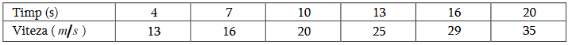
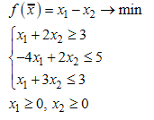

Examen la **CNMO**

Student: **Curmanschii Anton, IA1901**

## Nr.1

**Metoda coardelor.**

$f(x) = x^3 - 3x^2 - 2, \[a,b\] = \[3,4\]$

1. *Verificăm dacă funcția conține o singură rădăcină pe interval:*

$f(3) = 3^3 - 3 * 3^2 - 2 = 27 - 27 - 2 = -2 < 0$

$f(4) = 4^3 - 3 * 4^2 - 2 > 0$

Prin urmare, avem un numar impar de radacini pe interval.

$f'(x) = 3x^2 - 6x$, este pozitiva si monoton creste pe intervalul $\[3,4\]$.

Prin urmare, avem o singura radacina pe intervalul $\[3,4\]$.

2. *Selectam punct de start (a sau b) in dependenta de concavitate*

$f''(x) = 6x - 6$

$f''(3) > 0, f''(b) > 0$

$f(a)f''(a) = f(3)f''(3) < 0$, prin urmare $x_1 = a = 3$

## Nr.2

> Fie $L_3(x)$ polinomul de interpolare Lagrange construit pe mulțimea de noduri $(-1, -1), (0, 2), (1, y), (2, 4)$. Coeficientul lui $x^2$ în forma canonică pentru $L_3(x)$ este egal cu $-1$. Determinați valoarea $y$.

## Nr.3

Primele doua intervale $\[4,10\]$ si $\[10,16\]$ le putem calcula conform formulei generalizate lui Simpson, ultimul interval $\[16, 20\]$ aplicand formula trapezelor. 

Aproximarea Simpson estimeaza integrala pe baza unui polinom de grad 2, deci produce aproximari mai bune decat formula trapezelor (pe baza unui polinom de grad 1).

$$s = \int_{4}^{20} v(x) = \int_{4}^{10} v(x) \,dx + \int_{10}^{16} v(x) \,dx + \int_{16}^{20} v(x) \,dx$$

$$\int_{4}^{10} v(x) \approx \frac {10 - 4} {6} \Big(v(6) + 4v(7) + v(10)\Big) =  13 + 4 * 16 + 20 = 97$$

$$\int_{10}^{16} v(x) \approx \frac {16 - 10} {6} \Big(v(10) + 4v(13) + v(16)\Big) = 20 + 4 * 25 + 29 = 149$$

$$\int_{16}^{20} v(x) \approx (20 - 16) \frac {v(20) + v(16)} {2} = 4 * \frac {35 - 29} {2} = 6 * 2 = 12$$

$$s \approx 97 + 149 + 12 = 258$$

## Nr.4

## Nr.5

